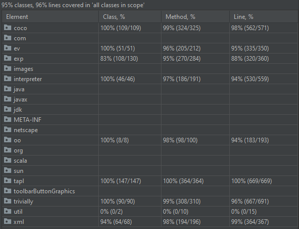

# Artifacts for Covariant Conversions (CoCo): A Design Pattern 

This project contains the source code for the CoCo Design Pattern.

## Installation

The project is self-contained and uses the Scala Build Tool (SBT) to compile
and launch all test cases and benchmarks.

These instructions explain how to install the requisite software from scratch on
a typical Windows 10 computer. if you have a different platform, likely you
already have installed Java (and possibly Scala) and you will need to tailor
these instructions to your platform.

You must have a working Java Development Kit (JDK) installation, at least Java 12.0.1
You must also make sure that $JAVA_HOME (or %JAVA_HOME%) is properly set to 
point to your Java installation.

To install a compatible Java version, download a suitable Java implementation. You
can find freely available ones to download from https://jdk.java.net. Here are 
some that would be suitable on different platforms:

* Windows: https://download.java.net/openjdk/jdk15/ri/openjdk-15+36_windows-x64_bin.zip
* Linux: https://download.java.net/openjdk/jdk15/ri/openjdk-15+36_linux-x64_bin.tar.gz

Unzip this directory and set %JAVA_HOME% to its location on disk.

You need to install the Scala Build Tool Version 1.5.0 (https://www.scala-sbt.org/1.x/docs/Setup.html)
which can be downloaded from https://www.scala-sbt.org/download.html. You do not need
administrator privileges to install SBT. 

* On a Windows 10 operating system, downloaded the MSI file, and execute
```msiexec /a sbt-1.5.0.msi TARGETDIR=SOME-DIRECTORY```. Either add this TARGETDIR to your environment variables or execute `sbt` from this 
directory from within the project using ```%TARGETDIR%\sbt```
* On a Linux operating system, download https://github.com/sbt/sbt/releases/download/v1.5.0/sbt-1.5.0.zip and simply
unzip the file and ensure the `sbt` executable is in your path or execute `sbt` from this
directory from within the project.

Retrieve the project code from the git repository and open up a command line in the 
top-level directory. Launch `sbt compile` in the directory and wait for the tool to download
all software dependencies. The tool will state "(this may take some time)" and that
is a true statement. This command will compile all source files.

The testing framework depends upon JUnit 5.

## Expression Problem

The Expression Problem (EP) refers to a common situation that occurs when evolving
software systems, specifically with regard to the structure of the data types and
the operations over these data types. As software engineers extend systems by adding
new data types and/or new operations, the goal is to avoid changing existing code.
As is well-documented by numerous researchers, the most common program design strategies
do not simultaneously support both forms of extensibility (Krishnamurthi 1998); in
functional programming, one can add new operations without modifying data types,
while object-oriented programming allows new data types to be defined without modifying
existing operations; however, neither approach can simultaneously avoid updating
existing code when adding both new data types and new operations.

As the popularity of EP grew, researchers in programming language theory rapidly 
developed various strategies to address the fundamental issues so clearly exposed by EP. 
Torgersen (2004) presented four criteria for characterizing and evaluating “solutions” to 
EP, which we summarize as:

* **Open For Extension** – any number of additional extensions can add both new data types and new operations.
* **Closed For Modification** – an extension must not modify any existing source code previously developed in an earlier part of the system.
* **Soundness** – it must be possible to detect unhandled combinations of data types and operations. This is essential for languages whose compilers detect type errors during compile time.
* **Avoid Duplicating Domain Logic** – any EP approach invariably follows specific coding patterns used throughout the solution. Still, it must not copy the non-trivial code logic necessary for performing an operation on a data type.

For each of the provided EP solutions, we evaluate the success (or failure) to achieve these criteria.
To this list we add two more:

* **Testable** - Each new extension must provide test cases to validate the run-time 
  execution of the operations over existing data types. Subsequent evolutions must not 
  require changes to these test cases.
* **Mergeable** - It is common software engineering practice to merge together two 
  independent code extensions. Merging independent branches must not require changes 
  to an individual branch.

Not every EP solution can achieve all criteria. CoCo does.

## Launching the Benchmarks

Once all dependencies have been installed, then execute ```sbt test```. This command will
execute all tests, and in the scrolling output you will see all test cases pass.

The final output (after about 5-10 minutes) is a comprehensive set of benchmark performance
results comparing the performance of CoCo against different EP solutions published from 
literature, including:

  * The Expression Problem, Trivially! Yanlin Wang and Bruno C. d. S. Oliveira. (2016)
    https://dl.acm.org/doi/10.1145/2889443.2889448
  * Synthesizing Object-Oriented and Functional Design to Promote Re-use
    Shriram Krishnamurthi, Matthias Felleisen, Daniel P. Friedman (1998)
    https://dl.acm.org/doi/10.5555/646155.679709
  * Interpreter Design Pattern, as suggested by Kim B. Bruce
    Some Challenging Typing Issues in Object-Oriented Languages
    Electronic Notes in Theoretical Computer Science 82 No. 8 (2003)
    URL: http://www.elsevier.nl/locate/entcs/volume82.html
    https://cs.pomona.edu/~kim/ftp/WOOD.pdf
  * Strawman Object-oriented implementation, which is decidedly *NOT* a solution to EP

Two CoCo implementations are provided to the Expression Problems -- one in Java and the 
other in Scala. In addition, the example problem from the paper is provided as a domain.

## Runtime Benchmark results

Full Benchmark results are included in an [Excel spreadsheet](documentation/Benchmark.xlsx),

All values in this summary table are the mean results from the full execution referenced 
above conducted on a Windows 10 machine. The numbers vary on a Linux platform. The
key point is that CoCo Java compares very closely to the runtime performance of
the Expression Problem Trivially solution. These benchmarks were executed within
the ScalaMeter testing framework (https://scalameter.github.io) to guard against
unpredictable JVM behavior.

The following table evaluates the time to evaluate an expression tree
of a given depth. The number of individual data types in the tree is 
power(2,depth)-1.

| Depth      | Coco Scala | Coco Java | Trivially | Ext. Visitor | Interpreter |
| --------- | ---------- | --------- | --------- | ----- | ---- |
|       7	|      	0.01 | 0 01 | 0.01 | 0.01 | 0.01 |
|       8	|      	0.01 | 0.01 | 0.01 | 0.01 | 0.01 |
|       9	|      	0.02 | 0.03 | 0.03 | 0.03 | 0.02 |
|       10	|      	0.05 | 0.05 | 0.05 | 0.06 | 0.05 | 
|       11	|      	0.1	 | 0.11 | 0.11 | 0.11 | 0.1 |
|       12	|      	0.2	 | 0.22 | 0.24 | 0.22 | 0.21 |
|       13	|      	0.39 | 0.58 | 0.58 | 0.63 | 0.4 |

Given a similar expression tree whose final level contains a subtraction
operation (5 - 0) that can be simplified by a producer operation, the following 
table shows the runtime performance based on the depth of the tree.

| Depth      | Coco Scala | Coco Java | Trivially | Ext. Visitor | Interpreter |
| --------- | ---------- | --------- | --------- | ----- | ---- |
|       7	|      	0.22 | 0 1 | 0.09 | 0.04 | 0.02 |
|       8	|      	0.53 | 0.2 | 0.21| 0.14| 0.04 |
|       9	|      	1.15 | 0.49 | 0.49 | 0.38 | 0.13 |
|       10	|      	2.67 | 1.16 | 1.15 | 0.84 | 0.29 | 
|       11	|      	5.85| 2.53 |  2.49 | 2.07| 0.7 |
|       12	|      	13.39 | 5.65 | 5.35 | 4.72 | 1.81 |
|       13	|      	28.2 | 12.26| 11.71 | 5.03 | 3.94 |

The table demonstrates that CoCo offers similar performance to "The Expression Problem, Trivially"
while supporting producer and binary methods, in addition to independent branching and merging.

## Code Coverage

The project code is an IntelliJ project (Compatible with their Community Edition 2020.3)
and within IntelliJ one can generate code coverage for the various Expression Problem Solutions.



The testing framework has the novel feature of using a chain of test cases -- one for each 
evolution -- to ensure that all earlier test cases are executed using objects instantiated
from newer evolutions. In this coverage report, the covered packages are:

  * coco -- Java-based CoCo implementation
  * exp -- Scala-based CoCo implementation
  * ev -- Java-based Extensible Visitor implementation
  * interpreter - Java-based Interpreter implementation 
  * oo -- Strawman object-oriented implementation
  * trivially -- Java-based Expression Problem Trivially! implementation

More fine-grained details of the coverage is summarized [here](documentation/coverage.txt)
and you can regenerate the table above from within IntelliJ by selecting the
"Run Tests with Coverage" option for each of the modules.

## References

Torgersen, M. (2004). The Expression Problem Revisited: Four new solutions using 
generics, European Conference on Object-Oriented Programming, LNCS 3086, pp. 123-146.
