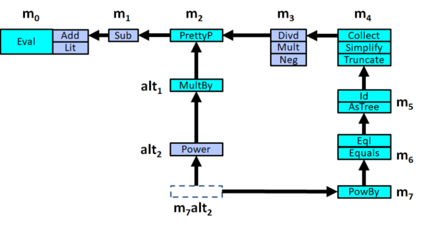

# Artifacts for Covariant Conversions (CoCo): A Design Pattern 

This project contains the source code illustrating the CoCo Design Pattern in
multiple programming languages.


## Installation

The project is self-contained and uses the Scala Build Tool (SBT) to compile
and launch all test cases and benchmarks.

These instructions explain how to install the requisite software from scratch on
a typical Windows 10 computer. if you have a different platform, likely you
already have installed Java (and possibly Scala) and you will need to tailor
these instructions to your platform.

You must have a working Java Development Kit (JDK) installation, at least Java 12.0.1
You must also make sure that $JAVA_HOME (or %JAVA_HOME%) is properly set to 
point to your Java installation.

To install a compatible Java version, download a suitable Java implementation. You
can find freely available ones to download from https://jdk.java.net. Here are 
some that would be suitable on different platforms:

* Windows: https://download.java.net/openjdk/jdk15/ri/openjdk-15+36_windows-x64_bin.zip
* Linux: https://download.java.net/openjdk/jdk15/ri/openjdk-15+36_linux-x64_bin.tar.gz

Unzip this directory and set %JAVA_HOME% or $JAVA_HOME to its location on disk.

You need to install the Scala Build Tool Version 1.5.0 (https://www.scala-sbt.org/1.x/docs/Setup.html)
which can be downloaded from https://www.scala-sbt.org/download.html. You do not need
administrator privileges to install SBT. 

* On a Windows 10 operating system, downloaded the MSI file, and execute
```msiexec /a sbt-1.5.0.msi TARGETDIR=SOME-DIRECTORY```. Either add this TARGETDIR to your environment variables or execute `sbt` from this 
directory from within the project using ```%TARGETDIR%\sbt```
* On a Linux operating system, download https://github.com/sbt/sbt/releases/download/v1.5.0/sbt-1.5.0.zip and simply
unzip the file and ensure the `sbt` executable is in your path or execute `sbt` from this
directory from within the project.

Retrieve the project code from the git repository and open up a command line in the 
top-level directory. Launch `sbt compile` in the directory and wait for the tool to download
all software dependencies (specifically, Java and Scala testing frameworks). The tool will state "(this may take some time)" and that
is a true statement. This command will compile all source files.

The testing framework depends upon JUnit 5.

Compile the C# case study using the .NET Core SDK which you can Download and install  
(https://dotnet.microsoft.com/download/dotnet/3.1). Open a terminal/console window and switch
to the subfolder `coco_csharp/CoCo.Tests`. Enter the command `dotnet test` and the program will
compile and all missing (and necessary) components will be downloaded. On a Windows 10 installation,
find this executable in `C:\Program Files\dotnext\dotnet.exe`; on Linux, make sure it is 
accessible from your `Path` variable.

The unit tests are automatically executed, and the test results are displayed.

## Live Image

You can find a live linux iso image under [live/ecoop_coco.iso](live/ecoop_coco.iso).
It can be downloaded via the (github) web interface or via `git lfs pull` in your checked out sources (requires [git lfs](https://git-lfs.github.com/)).
This image is intended for archival purposes.
It allows to browse, build, and test the code of this repository without internet access.
You can boot the image directly on your machine, or in a virtual machine.
We have tested it to work with qemu-5.2.0, starting it with

```
qemu-system-x86_64 \
  -enable-kvm -smp 2,sockets=1,cores=2,threads=1 -cpu host \
  -m 4096 -cdrom live/ecoop_coco.iso
```

which will cause it use use 2 cores of the host system (kvm line), and 4096 MB of RAM.
Less ram is not recommended, because performance tests might fail.

In VirtualBox 6.1 you need to:
* Click on "New", 
* Choose a name for the machine
* Set Type to "Linux"
* Set Version to "Debian 64 Bit"
* Set the memory size to 4096MB or more
* Select "Do not add a virtual hard disk"
* Click on Create
* Right Click on the newly selected machine and select Settings
* Add a new Optical Device under "Storage" by clicking on the Optical-Device-Logo next to the IDE Controller
* Click on Add in the Medium Dialog
* Select the `ecoop_coco.iso`, click on "Choose" and then on "Ok"
* Adjust the other machine settings according to your Host Hardware (e.g. adding more cores and activating acceleration)

Similar instructions apply for other virtualization technologies.

Depending on your computer it should also be possible to burn the image on a DVD or flash it on an USB-drive and directly boot it.
Using linux or similar systems the iso can be copied using
```
dd if=ecoop_coco.iso of=/dev/drive
```
where drive has to be replaced by the device file of your usb-drive (e.g. sdb).
Note that this will erase all data on the target device!

The archival image contains a minimal set of software and is based on [Devuan](https://www.devuan.org) (ceres/unstable), 
which is a Debian fork.
It is running with a Linux 5.10.6 kernel and boots into an xserver.
The image is immutable and will not store anything you do with it, unless you add and mount an additional medium after it has booted.
License information and sources are included in the image, or available on via the [devuan webpage](https://www.devuan.org), [microsoft packages](https://docs.microsoft.com/en-us/windows-server/administration/linux-package-repository-for-microsoft-software), and [the vscodium repository](https://gitlab.com/paulcarroty/vscodium-deb-rpm-repo).


Note that the image is intended for archival purposes:
* It will not receive any security updates
* It should only be booted on machines that are isolated (e.g. by a VM or physically) from any valuable data
* It is not meant to provide a production-grade user experience
* It does not contain translations
* It does not have support for assistive technologies (though if you need any, please do not hesitate to get in contact and tell us how to improve the image for you!)

The image was created using [instructions by Will Haly](https://willhaley.com/blog/custom-debian-live-environment/).

## Case Studies

There are several case studies included in this project. 

### DOM XML Example

This example contains an object-oriented model for a subset of XML, 
demonstrating the CoCo design pattern applied to a familiar context.

* dom -- Java-based dom implementation ([README](dom/src/main/java/xml/README.md))
* dom_scala -- Scala-based dom implementation ([README](dom_scala/src/main/scala/xml/README.md))

### Expression Problem

The Expression Problem (EP) refers to a common situation that occurs when evolving
software systems, specifically with regard to the structure of the data types and
the operations over these data types. As software engineers extend systems by adding
new data types and/or new operations, the goal is to avoid changing existing code.
As is well-documented by numerous researchers, the most common program design strategies
do not simultaneously support both forms of extensibility (Krishnamurthi 1998); in
functional programming, one can add new operations without modifying data types,
while object-oriented programming allows new data types to be defined without modifying
existing operations; however, neither approach can simultaneously avoid updating
existing code when adding both new data types and new operations.

As the popularity of EP grew, researchers in programming language theory rapidly 
developed various strategies to address the fundamental issues so clearly exposed by EP. 
Torgersen (2004) presented four criteria for characterizing and evaluating “solutions” to 
EP, which we summarize as:

* **Open For Extension** – any number of additional extensions can add both new data types and new operations.
* **Closed For Modification** – an extension must not modify any existing source code previously developed in an earlier part of the system.
* **Soundness** – it must be possible to detect unhandled combinations of data types and operations. This is essential for languages whose compilers detect type errors during compile time.
* **Avoid Duplicating Domain Logic** – any EP approach invariably follows specific coding patterns used throughout the solution. Still, it must not copy the non-trivial code logic necessary for performing an operation on a data type.

For each of the provided EP solutions, we evaluate the success (or failure) to achieve these criteria.
To this list we add two more:

* **Testable** - Each new extension must provide test cases to validate the run-time 
  execution of the operations over existing data types. Subsequent evolutions must not 
  require changes to these test cases.
* **Mergeable** - It is common software engineering practice to merge together two 
  independent code extensions. Merging independent branches must not require changes 
  to an individual branch.

Not every EP solution can achieve all criteria. CoCo does. We use the domain of 
mathematical expressions to demonstrate the various EP solutions.



In this domain, a primary development branch (**m0** through **m7**)  adds the following 
capabilities:

* **m0** starts with an `Add` and `Lit` data types with a supporting operation to evaluate recursive
expression trees to produce a `double` value.
* **m1** extends with the `Sub` data type to represent the subtraction of two expressions.
* **m2** extends with a `PrettyP` operation to produce a human-readable expression with parentheses.
* **m3** extends with three new data types -- `Mult`, `Neg`, and `Divd`.
* **m4** extends with a `Collect` operation which collects all literal values in an expression
tree and a `Simplify` producer operation that performs reasonable mathematical simplifications
to produce a new expression tree: for example, "5 - 0" could be simplified to the literal "5".
A `Truncate` operation has mutable side effects, replacing expressions at a given level in 
an expression tree to a literal containing their evaluated value.
* **m5** extends with an `AsTree` operation to produce a separate tree-like representation using 
`Node` and `Leaf` object. The `Id` operation assigns an integer for each data type.
* **m6** extends with two binary operations. `Equals` converts an expression and its parameter into 
a tree, using `AsTree`, to determine equality. `Eql` dispatches to its arguments instead.
* **m7** extends with a `PowBy` producer operation that returns an expression raised to an exponent value.

An independent development effort had split off from the **m2** evolution, leading to:

* **alt1** extends **m2** by adding a `MultBy` producer operation that returns an expression
multiplied by an expression.
* **alt2** extends **alt1** by adding a new `Power` data type representing an expression raised
to the power of another expression.
  
These two developments efforts are merged together by **m7alt2** which provides the necessary
artifacts to ensure that every possible (data type, operation) pair has an implementation. In 
some cases, the result is greatly simplified: for example, now that `Power` and `PowBy` exist 
at the same time, the `PowBy` operation is replaced with logic to create a `Power` instance.
Similarly, `Mult` and `MultBy` final coexist and a similar simplification takes place. The 
existing binary operations, `Eql` and `Equals` now must contend with a new data type from an
independent effort.

This case study truly represents a non-trivial exploration of the expression problem.
In addition, we include a significant collection of test cases to ensure code coverage.

This project contains a number of fully realized implementations of various EP approaches:

* coco -- Java-based CoCo implementation ([README](coco/src/main/java/coco/ep/README.md))
* coco_scala -- Scala-based CoCo implementation ([README](coco_scala/src/main/scala/exp/README.md))
* coco_csharp -- C#-based CoCo implementation ([README](coco_csharp/CoCo/EP/README.md))
* extensible_visitor -- Java-based Extensible Visitor implementation ([README](extensible_visitor/src/main/java/ev/ep/README.md))
* interpreter - Java-based Interpreter implementation ([README](interpreter/src/main/java/interpreter/ep/README.md))
* oo -- Strawman object-oriented implementation ([README](oo/src/main/java/oo/ep/README.md))
* trivially -- Java-based Expression Problem Trivially! implementation ([README](trivially/src/main/java/trivially/ep/README.md))

### Types and Programming Languages (TAPL)

This Java example implements parts of the [Types and
Programming Languages (TAPL) textbook by Pierce](https://www.cis.upenn.edu/~bcpierce/tapl).

Our solution implements typed and untyped compiler modules for natural numbers, 
Booleans, floats and strings, let-bindings, function application, and lambda-calculus.

* tapl -- Java-based TAPL implementation ([README](tapl/src/main/java/tapl/README.md))

## Launching the Benchmarks

Once all dependencies have been installed, then execute ```sbt test```. This command will
execute all tests, and in the scrolling output you will see all test cases pass.

The final output (after about 5-10 minutes) is a comprehensive set of benchmark performance
results comparing the performance of CoCo against different EP solutions published from 
literature, including:

  * The Expression Problem, Trivially! Yanlin Wang and Bruno C. d. S. Oliveira. (2016)
    https://dl.acm.org/doi/10.1145/2889443.2889448
  * Synthesizing Object-Oriented and Functional Design to Promote Re-use
    Shriram Krishnamurthi, Matthias Felleisen, Daniel P. Friedman (1998)
    https://dl.acm.org/doi/10.5555/646155.679709
  * Interpreter Design Pattern, as suggested by Kim B. Bruce
    Some Challenging Typing Issues in Object-Oriented Languages
    Electronic Notes in Theoretical Computer Science 82 No. 8 (2003)
    URL: http://www.elsevier.nl/locate/entcs/volume82.html
    https://cs.pomona.edu/~kim/ftp/WOOD.pdf
  * Strawman Object-oriented implementation, which is decidedly *NOT* a solution to EP

Three CoCo implementations are provided in multiple languages -- Java, Scala and C#. 
In addition, the example problem from the paper is provided as a domain.

## Runtime Benchmark results

Full Benchmark results are included in an [Excel spreadsheet](documentation/Benchmark.xlsx),

All values in this summary table are the mean results from the full execution referenced 
above conducted on a Windows 10 machine. The numbers vary on a Linux platform. The
key point is that CoCo Java compares very closely to the runtime performance of
the Expression Problem Trivially solution. These benchmarks were executed within
the ScalaMeter testing framework (https://scalameter.github.io) to guard against
unpredictable JVM behavior.

The following table evaluates the time to evaluate an expression tree
of a given depth. The number of individual data types in the tree is 
power(2,depth)-1.

| Depth      | Coco Scala | Coco Java | Trivially | Ext. Visitor | Interpreter |
| --------- | ---------- | --------- | --------- | ----- | ---- |
|       7	|      	0.01 | 0 01 | 0.01 | 0.01 | 0.01 |
|       8	|      	0.01 | 0.01 | 0.01 | 0.01 | 0.01 |
|       9	|      	0.02 | 0.03 | 0.03 | 0.03 | 0.02 |
|       10	|      	0.05 | 0.05 | 0.05 | 0.06 | 0.05 | 
|       11	|      	0.1	 | 0.11 | 0.11 | 0.11 | 0.1 |
|       12	|      	0.2	 | 0.22 | 0.24 | 0.22 | 0.21 |
|       13	|      	0.39 | 0.58 | 0.58 | 0.63 | 0.4 |

Given a similar expression tree whose final level contains a subtraction
operation (5 - 0) that can be simplified by a producer operation, the following 
table shows the runtime performance based on the depth of the tree.

| Depth      | Coco Scala | Coco Java | Trivially | Ext. Visitor | Interpreter |
| --------- | ---------- | --------- | --------- | ----- | ---- |
|       7	|      	0.22 | 0 1 | 0.09 | 0.04 | 0.02 |
|       8	|      	0.53 | 0.2 | 0.21| 0.14| 0.04 |
|       9	|      	1.15 | 0.49 | 0.49 | 0.38 | 0.13 |
|       10	|      	2.67 | 1.16 | 1.15 | 0.84 | 0.29 | 
|       11	|      	5.85| 2.53 |  2.49 | 2.07| 0.7 |
|       12	|      	13.39 | 5.65 | 5.35 | 4.72 | 1.81 |
|       13	|      	28.2 | 12.26| 11.71 | 5.03 | 3.94 |

The table demonstrates that CoCo offers similar performance to "The Expression Problem, Trivially"
while supporting producer and binary methods, in addition to independent branching and merging.

## Code Statistics

Using the cloc tool (https://github.com/AlDanial/cloc) the following are the statistics 
for all code in this project

### All Code

| Language | files  | blank  |  comment  | code  |
| -------- |  ----- | -----  |  -------- | ------|
| Java     | 656    | 3243   | 107       | 11295 |
| C#       | 140    | 345    | 5         | 1970  |
| Scala    | 32     | 364    | 14        | 1406  |
||
| Sum      | 830    | 3960   | 126       | 14691 |

```cloc `git ls-files | grep -E "\.((scala)|(java)|(cs))"` ```

### Just Tests
| Language | files  | blank  |  comment  | code  |
| -------- |  ----- | -----  |  -------- | ------|
| Java     | 89     | 790    | 16        | 3123 |
| Scala    | 15     | 169    | 3         | 633  |
| C#       | 11     | 100    | 3         | 476  |
||
| Sum      | 116    | 1064   | 22       | 4247 |

```cloc `git ls-files | grep -E "((src/test)|(CoCo\.Tests))/.*\.((scala)|(java)|(cs))` ```

### Just Expression Problem code (excluding tests)

This covers CoCo, Extensible Visitor, Interpreter Design Pattern, Trivially, and OO.

| Language | files  | blank  |  comment  | code  |
| -------- |  ----- | -----  |  -------- | ------|
| Java     | 128    | 536    | 2         | 1653 |
| C#       | 129    | 245    | 2         | 1494 |
| Scala    | 13     | 151    | 11        | 565  |
||
| Sum      | 270    | 932    | 15        | 3712 |

```cloc `git ls-files | grep -E "((coco/src/main)|(CoCo)|(coco_scala/src/main))/.*\.((scala)|(java)|(cs))"` ```


### Just XML example domain (excluding tests)

| Language | files  | blank  |  comment  | code  |
| -------- |  ----- | -----  |  -------- | ------|
| Java     | 31    | 127     | 1         |  465  |
| Scala    |  4    |  44     | 0         |  208  |
||
| Sum      | 30    | 124     | 0         |  673  |

```cloc `git ls-files | grep -E "(((dom|dom_scala)/src/main))/.*\.((scala)|(java)|(cs))"` ```

### TAPL domain (excluding tests)

| Language            | files  | blank  |  comment  | code  |
| --------            |  ----- | -----  |  -------- | ------|
| non-finalized Java  | 99     | 219    | 0         | 825   |
| finalized Java      | 93     | 193    | 2         | 862   |
||
| Sum                 | 192    | 432    | 2        | 1687 |

Non-finalized code:
``` cloc `git ls-files | grep -E "tapl/src/main" | grep -v "/f/"` ```

Finalized code:
``` cloc `git ls-files | grep -E "tapl/src/main" | grep "/f/"` ```

The finalized Java code is boilerplate Java code. The non-finalized Java code is not. 

## Code Coverage

The project code is an IntelliJ project (Compatible with their Community Edition 2020.3)
and within IntelliJ one can generate code coverage for the various Expression Problem Solutions.


The testing framework has the novel feature of using a chain of test cases -- one for each 
evolution -- to ensure that all earlier test cases are executed using objects instantiated
from newer evolutions. In this coverage report, the covered packages are:

  * coco -- Java-based CoCo implementation
  * exp -- Scala-based CoCo implementation
  * ev -- Java-based Extensible Visitor implementation
  * interpreter - Java-based Interpreter implementation 
  * oo -- Strawman object-oriented implementation
  * trivially -- Java-based Expression Problem Trivially! implementation

More fine-grained details of the coverage is summarized [here](documentation/coverage.txt)
and you can regenerate the table above from within IntelliJ by selecting the
"Run Tests with Coverage" option for each of the modules.

## References

Torgersen, M. (2004). The Expression Problem Revisited: Four new solutions using 
generics, European Conference on Object-Oriented Programming, LNCS 3086, pp. 123-146.

## License

Files in this repository, except for the contents of the [live/ecop_coco.iso](live/ecop_coco.iso),
archival live image are provided under the Apache 2.0 license, that is for every file:

```
   Copyright 2021 Jan Bessai, George Heineman, Boris Düdder

   Licensed under the Apache License, Version 2.0 (the "License");
   you may not use this file except in compliance with the License.
   You may obtain a copy of the License at

       http://www.apache.org/licenses/LICENSE-2.0

   Unless required by applicable law or agreed to in writing, software
   distributed under the License is distributed on an "AS IS" BASIS,
   WITHOUT WARRANTIES OR CONDITIONS OF ANY KIND, either express or implied.
   See the License for the specific language governing permissions and
   limitations under the License.

```

A copy of the full original license text is also provided in [LICENSE](LICENSE).

